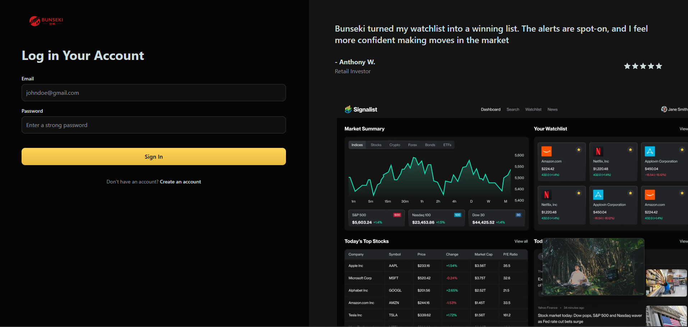
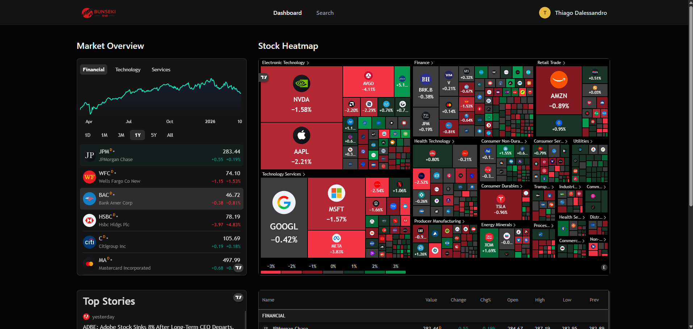
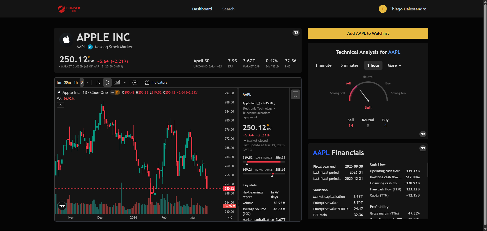

# Bunseki 📈

**Bunseki** (分析 - Japanese for "analysis") is a full-stack stock market analysis platform where users can explore real-time market data, search for stocks, view detailed financial charts, and receive AI-personalized email summaries.


🔗 **[Live Demo](https://bunseki-stock-tracker-app.vercel.app/)**

---

## What is this project?

This is a **web application** that helps users track and analyze the stock market. Think of it as a dashboard similar to Yahoo Finance or Bloomberg, but built from scratch to demonstrate modern web development practices.

Users can:

- View live market data and trends at a glance
- Search for any stock and see detailed charts and financial information
- Create an account with a personalized profile
- Receive automated, AI-written emails with market news tailored to their interests

---

## Key Features

| Feature                     | Description                                                                                                               |
| --------------------------- | ------------------------------------------------------------------------------------------------------------------------- |
| **Interactive Dashboard**   | A homepage displaying live market overviews, stock heatmaps, trending news, and market quotes — all updating in real-time |
| **Stock Search**            | Quickly find any stock using a search bar with keyboard shortcuts (Ctrl/Cmd + K) — results appear instantly as you type   |
| **Stock Detail Pages**      | Each stock has its own page with professional-grade charts, technical analysis indicators, and company financial data     |
| **User Authentication**     | Secure sign-up and login system where users create accounts with email and password                                       |
| **Personalized Onboarding** | New users fill out their investment goals, risk tolerance, and preferred industries to customize their experience         |
| **AI-Powered Emails**       | Automated welcome emails and daily news summaries written by Google's Gemini AI, personalized to each user's profile      |
| **Dark Theme UI**           | A sleek, modern interface designed for comfortable extended use                                                           |

---

## Technologies Used

This project showcases proficiency in a modern full-stack development environment:

### Frontend

- **Next.js 16** — React framework for building fast, SEO-friendly web applications
- **React 19** — JavaScript library for building user interfaces
- **TypeScript** — Adds type safety to JavaScript, reducing bugs and improving code quality
- **Tailwind CSS** — Utility-first CSS framework for rapid UI development
- **Radix UI / shadcn/ui** — Accessible, customizable component libraries

### Backend & Data

- **MongoDB** — NoSQL database for storing user data and preferences
- **Mongoose** — Elegant MongoDB object modeling for Node.js
- **Better Auth** — Modern authentication library for secure user login
- **Finnhub API** — Real-time stock market data provider
- **TradingView Widgets** — Professional financial charts and market visualizations

### Automation & AI

- **Inngest** — Background job scheduler for automated tasks (email sending, scheduled reports)
- **Google Gemini AI** — Generates personalized email content based on user profiles
- **Nodemailer** — Email delivery service integration

---

## Getting Started

### Prerequisites

- Node.js 18+
- MongoDB instance (local or Atlas)
- Finnhub API key
- SMTP credentials for email

### Installation

1. Clone the repository:

   ```bash
   git clone https://github.com/yourusername/bunseki.git
   cd bunseki
   ```

2. Install dependencies:

   ```bash
   npm install
   ```

3. Create a `.env.local` file with your environment variables:

   ```env
   # MongoDB
   MONGODB_URI=your_mongodb_connection_string

   # Better Auth
   BETTER_AUTH_SECRET=your_auth_secret
   BETTER_AUTH_URL=http://localhost:3000

   # Finnhub
   NEXT_PUBLIC_FINNHUB_API_KEY=your_finnhub_api_key

   # Inngest
   INNGEST_EVENT_KEY=your_inngest_event_key
   INNGEST_SIGNING_KEY=your_inngest_signing_key

   # Email (SMTP)
   EMAIL_HOST=your_smtp_host
   EMAIL_PORT=587
   EMAIL_USER=your_email
   EMAIL_PASS=your_email_password
   ```

4. Run the development server:

   ```bash
   npm run dev
   ```

5. In a separate terminal, start the Inngest dev server:

   ```bash
   npm run inngest
   ```

6. Open [http://localhost:3000](http://localhost:3000) in your browser.

### Available Scripts

| Command             | Description                             |
| ------------------- | --------------------------------------- |
| `npm run dev`       | Start development server with Turbopack |
| `npm run build`     | Build for production                    |
| `npm run start`     | Start production server                 |
| `npm run lint`      | Run ESLint                              |
| `npm run inngest`   | Start Inngest dev server                |
| `npm run test-db`   | Test database connection                |
| `npm run check-env` | Verify environment variables            |

## Project Structure

```
bunseki/
├── app/                    # Next.js App Router
│   ├── (auth)/            # Authentication pages (sign-in, sign-up)
│   ├── (root)/            # Main app pages
│   │   ├── page.tsx       # Dashboard with market widgets
│   │   └── stocks/[symbol]/ # Stock detail pages
│   └── api/               # API routes
│       ├── inngest/       # Inngest webhook handler
│       └── test-db/       # Database test endpoint
├── components/            # React components
│   ├── ui/               # shadcn/ui components
│   └── forms/            # Form components
├── database/             # MongoDB connection & models
├── hooks/                # Custom React hooks
├── lib/                  # Utilities and configurations
│   ├── actions/          # Server actions
│   ├── better-auth/      # Authentication setup
│   ├── inngest/          # Background job functions
│   └── nodemailer/       # Email templates
├── middleware/           # Next.js middleware
├── public/               # Static assets
└── types/                # TypeScript type definitions
```

## API Integrations

### Finnhub

Provides real-time stock market data including symbol search and market news.

### TradingView

Professional-grade financial widgets embedded throughout the app:

- Market Overview & Stock Heatmap
- Candlestick Charts & Technical Analysis
- Company Financials & Market Quotes
- News Timeline

### Inngest

Handles background tasks:

- **Welcome Email** — AI-personalized welcome email sent automatically on user signup
- **Daily News Summary** — Scheduled daily email with curated market news

---

## Screenshots







---

## License

This project is licensed under the MIT License.

---

**Built by a passionate developer for the love of markets and clean code.**
